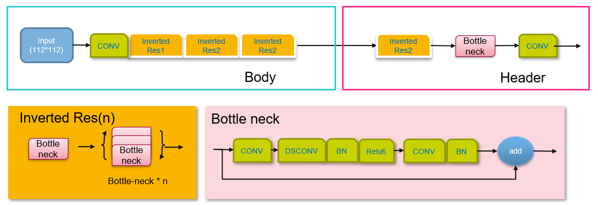
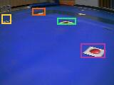

# YOLO3 Nano 

#### Introduction

A very lightweight Yolo3 implementation by Tensorflow 2.x.

## Requirements

tensorflow==2.11.0

numpy==1.23.4

pillow

opencv-python

configparser

argparse

matplotlib

## Training

* Fill dataset path(unzip the voc tar file) in config.cfg: voc_folder
* Convert dataset, voc type support only

  * python voc_convertor.py
* Generate anchors

  * python kmeans.py
* Model training

  * python train.py
* Model envluate

  * python evaluate.py

## Detect on PC

python detect.py -model yolo3_iou_smartcar_final.tflite -image test.jpg

## Deploy on OpenART

copy 'yolo3_iou_smartcar_final_with_post_processing.tflite' into sdcard and plugin to openart hardwares.
